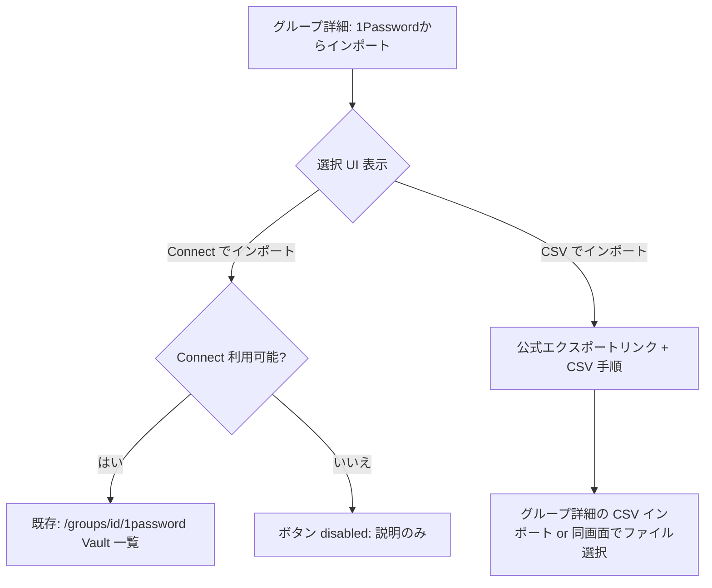

# 1Password インポート：Connect / CSV 選択と未連携時の誘導

最終更新: 2026-03-28

## 1. 目的と背景

- すべてのデプロイで **1Password Connect** を用意しているわけではない。
- Connect が無い環境では、従来どおり Vault API を叩くと **エラー表示**になり、利用者が **CSV インポート**へ迷わず移れない。
- **Connect が使える環境**と**使えない環境**の両方で、同じエントリポイントから **意図した手段（Connect または CSV）** を選べるようにする。

## 2. 要件

- 「**1Passwordからインポート**」操作時、**モーダルまたは中間画面を 1 枚挟み**、次のどちらかをユーザーが選べること。
  - **1Password Connect でインポートする**（既存の Vault 選択〜アイテム選択フローへ）
  - **1Password から CSV をエクスポートし、その CSV をこのサービスでインポートする**（公式手順の提示 + グループ上の CSV インポートへ誘導）
- **Connect が環境で有効**（後述の判定が `available`）なユーザーは、**両方を選択可能**とする（どちらか一方に固定しない）。
- **Connect が環境で未設定**のときは、Connect 側のオプションを **disabled** にし、**Connect 用 API を呼ばない**ことで、Vault 取得エラーを見せずに **CSV 誘導に集中**できるようにする。
- **1Password 公式**のエクスポート手順 URL を提示し、ユーザーが自環境で CSV を用意できるようにする。

### 2.1 用語の整理（重要）

- 現状の実装では、Connect の有無は **ログインユーザー個人の属性ではなく**、サーバーの **`ONEPASSWORD_CONNECT_URL` / `ONEPASSWORD_CONNECT_TOKEN`**（デプロイ単位）で決まる。
- 画面上の説明は **「この環境では 1Password Connect を利用できません」** のように、**環境依存**であることが伝わる文言を用いる（「あなたのアカウントが未連携」だけだと誤解が生じやすい）。
- 将来、**ユーザー単位**の Connect 設定が追加された場合は、`connection-status` のレスポンスにフラグを足し、**disabled 判定を上書き**できるようにする。

## 3. ユーザー体験（フロー）

1. ユーザーが **「1Passwordからインポート」** を押す。
2. **モーダル**、または **専用の短いルート**（例: `/dashboard/groups/[id]/import/1password`）で **2 択**を表示する。
3. **Connect を選べる条件**が満たされていれば、**「Connect でインポート」** が有効。押下で既存の 1Password インポート画面へ遷移（または同一画面内で次ステップ）。
4. **Connect が未設定**のときは **「Connect でインポート」** を **disabled**。ツールチップまたは補足文で理由（管理者による環境設定が必要であること）を示す。
5. **「CSV でインポート」** は常に利用可能。**公式のエクスポート手順**への外部リンクと、**当サービスでの CSV アップロード**への導線（グループ詳細へ戻す／ファイル input を起動）を並べる。

### 3.1 モーダル vs 専用ページ

| 方式           | 向くケース                                                                                    |
| -------------- | --------------------------------------------------------------------------------------------- |
| **モーダル**   | 説明が短く、グループ詳細から離れたくないとき。                                                |
| **専用ルート** | 公式リンク・注意書きが多く、スクロールしやすいレイアウトにしたいとき。共有 URL にもしやすい。 |

実装時にどちらかを選ぶ。情報量が多い場合は **専用ページ**を推奨。

## 4. 画面・コンポーネント設計

### 4.1 新規（想定）

| 名前（仮）                                                           | 役割                                                                                                                                 |
| -------------------------------------------------------------------- | ------------------------------------------------------------------------------------------------------------------------------------ |
| `OnePasswordImportChoiceDialog` または `OnePasswordImportChoicePage` | 2 択 UI。Connect ボタンの disabled、`connection-status` に基づく文言、CSV 用の公式リンクと CTA。                                     |
| 既存 `1password/page.tsx`                                            | **Connect フロー本体**。選択画面から遷移したときだけ表示するか、URL 直叩き対策で **Connect 不可時は Callout のみ**にフォールバック。 |

### 4.2 グループ詳細（`groups/[id]/page.tsx`）

- **「1Passwordからインポート」** のリンク先を、上記 **選択 UI** に変更する（モーダルなら onClick で開く、専用ページなら `href` を差し替え）。
- 従来どおり同一ページに **CSV からインポート**があるため、選択画面の **CSV 側**からは **アンカー・スクロール**または **ファイル input のフォーカス**で繋げてもよい。

### 4.3 状態（クライアント）

- `connectionStatus`: `'loading' | 'available' | 'unavailable' | 'error'`
  - 取得元: `GET /api/1password/connection-status`（下記）。
- `unavailable` のとき Connect ボタン **disabled**。`error` は「状態取得に失敗」用（Connect と CSV の両方は選べるが、Connect はリスク表示または再試行）。

## 5. API・データ設計

### 5.1 `GET /api/1password/connection-status`

- **認証**: 既存と同様、セッション必須。
- **レスポンス（例）**
  - `{ "available": true }` … URL とトークンが両方設定されている。
  - `{ "available": false, "reason": "not_configured" }` … いずれか欠けている。
- **HTTP ステータス**: 上記は **200**。秘密は返さない。
- **目的**: UI が **先に分岐**でき、Connect 未設定時に **`/api/1password/vaults` を呼ばない**。

### 5.2 既存 `GET /api/1password/vaults`

- 挙動は維持してよい。フロントは **選択で Connect を選んだ場合のみ**呼び出す。

### 5.3 公式 URL（定数化）

- アプリ内では `apps/web/src/lib/1password/external-links.ts` 等に集約する。

| 用途                         | URL（例）                                            |
| ---------------------------- | ---------------------------------------------------- |
| データのエクスポート（公式） | `https://support.1password.com/export/`              |
| Connect（管理者・参考）      | `https://developer.1password.com/docs/connect/`      |
| 共有 Vault の作成（参考）    | `https://support.1password.com/create-share-vaults/` |

文言は「CSV の作り方は 1Password 公式を参照」が中心。Connect 用リンクは **環境で Connect が無いときの管理者向け**に小さく載せる程度でよい。

## 6. 懸念・エッジケース

| 事象                                    | 方針                                                                                                                                                                                        |
| --------------------------------------- | ------------------------------------------------------------------------------------------------------------------------------------------------------------------------------------------- |
| Connect は設定済みだが Vault API が失敗 | 既存フローでエラー表示。**同じ画面に「CSV でインポートへ」**の副次導線を出す。                                                                                                              |
| `connection-status` の取得失敗          | `error` 表示 + 再試行。Connect は「利用可否不明」のため disabled にするか、押下時に従来どおり API で確定するかは実装時に決定（安全側は **不明時は Connect を押せるが失敗時に CSV 誘導**）。 |
| 二重リクエスト                          | グループ詳細と選択画面の両方で status を取る場合、同一セッション内で **1 回に抑える**か、軽量 API のため **都度取得を許容**。                                                               |
| アクセシビリティ（モーダル時）          | `role="dialog"`、フォーカストラップ、Esc で閉じる。                                                                                                                                         |

## 7. 実装タスク一覧（チェックリスト）

1. [x] `GET /api/1password/connection-status` 追加
2. [x] `external-links.ts`（公式 URL 定数）
3. [x] 選択 UI（専用ページ `/dashboard/groups/[id]/import/1password`）とグループ詳細からの導線
4. [x] Connect 不可時、`/dashboard/groups/[id]/1password` 直アクセス時のフォールバック（Callout + CSV 誘導）
5. [ ] 既存 E2E の更新（該当すれば）

## 8. 関連ドキュメント

- デプロイで Connect を有効にする手順: `docs/05-deployment/05-onepassword-connect-cloud-run.md`
- ローカル Connect: リポジトリ直下 `infra/1password-connect/README.md`
